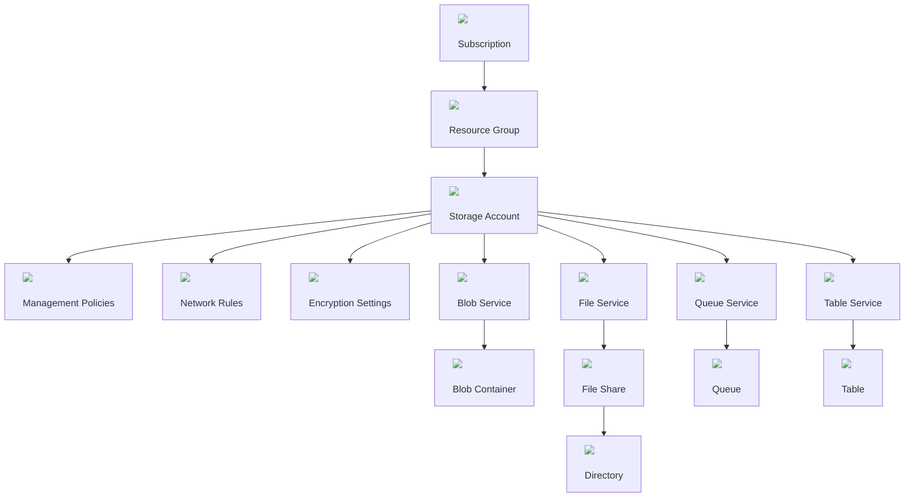

# Test Page

```mermaid
flowchart TD
    sub["<img src='https://raw.githubusercontent.com/IngridAtMicrosoft/DocsContent/main/singlesource/media/icons/2025/subscription.svg' width='36'/><br/>Subscription"]
    rg["<img src='https://raw.githubusercontent.com/IngridAtMicrosoft/DocsContent/main/singlesource/media/icons/2025/resourcegroup.svg' width='36'/><br/>Resource Group"]
    sa["<img src='https://raw.githubusercontent.com/IngridAtMicrosoft/DocsContent/main/singlesource/media/icons/2025/storageaccount.svg' width='36'/><br/>Storage Account"]
    management["<img src='https://raw.githubusercontent.com/IngridAtMicrosoft/DocsContent/main/singlesource/media/icons/2025/managementpolicy.svg' width='36'/><br/>Management Policies"]
    netrules["<img src='https://raw.githubusercontent.com/IngridAtMicrosoft/DocsContent/main/singlesource/media/icons/2025/networkrules.svg' width='36'/><br/>Network Rules"]
    encryption["<img src='https://raw.githubusercontent.com/IngridAtMicrosoft/DocsContent/main/singlesource/media/icons/2025/encryption.svg' width='36'/><br/>Encryption Settings"]

    blobsvc["<img src='https://raw.githubusercontent.com/IngridAtMicrosoft/DocsContent/main/singlesource/media/icons/2025/blobservice.svg' width='36'/><br/>Blob Service"]
    blobcontainer["<img src='https://raw.githubusercontent.com/IngridAtMicrosoft/DocsContent/main/singlesource/media/icons/2025/container.svg' width='36'/><br/>Blob Container"]

    filesvc["<img src='https://raw.githubusercontent.com/IngridAtMicrosoft/DocsContent/main/singlesource/media/icons/2025/fileservice.svg' width='36'/><br/>File Service"]
    fileshare["<img src='https://raw.githubusercontent.com/IngridAtMicrosoft/DocsContent/main/singlesource/media/icons/2025/fileshare.svg' width='36'/><br/>File Share"]
    directory["<img src='https://raw.githubusercontent.com/IngridAtMicrosoft/DocsContent/main/singlesource/media/icons/2025/directory.svg' width='36'/><br/>Directory"]

    queuesvc["<img src='https://raw.githubusercontent.com/IngridAtMicrosoft/DocsContent/main/singlesource/media/icons/2025/queueservice.svg' width='36'/><br/>Queue Service"]
    queue["<img src='https://raw.githubusercontent.com/IngridAtMicrosoft/DocsContent/main/singlesource/media/icons/2025/queue.svg' width='36'/><br/>Queue"]

    tablesvc["<img src='https://raw.githubusercontent.com/IngridAtMicrosoft/DocsContent/main/singlesource/media/icons/2025/tableservice.svg' width='36'/><br/>Table Service"]
    table["<img src='https://raw.githubusercontent.com/IngridAtMicrosoft/DocsContent/main/singlesource/media/icons/2025/table.svg' width='36'/><br/>Table"]

    %% Connections
    sub --> rg
    rg --> sa

    sa --> management
    sa --> netrules
    sa --> encryption

    sa --> blobsvc
    blobsvc --> blobcontainer

    sa --> filesvc
    filesvc --> fileshare
    fileshare --> directory
    
    sa --> queuesvc
    queuesvc --> queue

    sa --> tablesvc
    tablesvc --> table
```