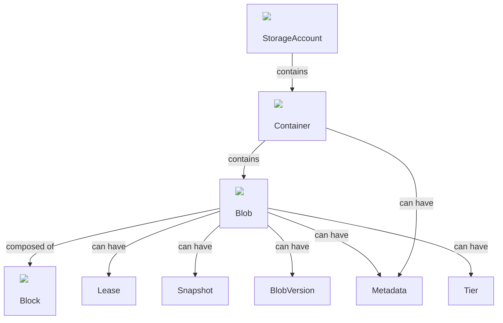

# Blob

Mermaid SVG goes here.

```mermaid
graph TD
    StorageAccount["<img src='media/icons/2025/analytics/00009-icon-service-Log-Analytics-Workspaces.svg' width='36'/><br/>StorageAccount"]
    Container["<img src='/media/icons/2025/general/10839-icon-service-Storage-Container.svg' width='36'/><br/>Container"]
    Blob["<img src='/media/icons/2025/general/10780-icon-service-Blob-Block.svg' width='36'/><br/>Blob"]
    Block["<img src='/media/icons/2025/general/10780-icon-service-Blob-Block.svg' width='36'/><br/>Block"]
    Lease["Lease"]
    Snapshot["Snapshot"]
    Tier["Tier"]
    BlobVersion["BlobVersion"]
    Metadata["Metadata"]


    StorageAccount -->|contains| Container
    Container -->|contains| Blob
    Blob -->|composed of| Block
    Blob -->|can have| Lease
    Blob -->|can have| Snapshot
    Blob -->|can have| BlobVersion
    Blob -->|can have| Metadata
    Blob -->|can have| Tier
    Container -->|can have| Metadata
```
