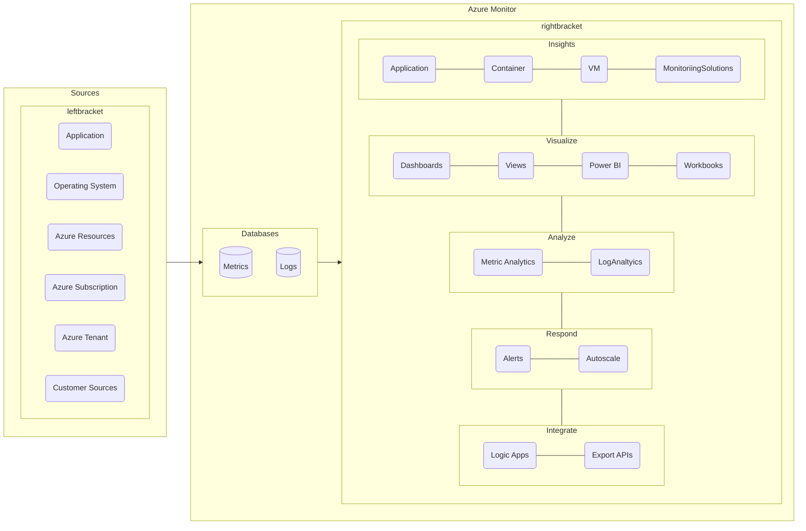

```mermaid
flowchart LR
  subgraph am [Azure Monitor]
    subgraph databases [Databases]
      Metrics[(Metrics)]
      Logs[(Logs)]
    end
    subgraph rightbracket
      subgraph insights [Insights]
        Application(Application)
        Container(Container)
        VM(VM)
        MonitoringSolutions(MonitoriingSolutions)
      end
      subgraph visualize [Visualize]
        Dashboards(Dashboards)
        Views(Views)
        PowerBI(Power BI)
        Workbooks(Workbooks)
      end
      subgraph analyze [Analyze]
        MetricAnalytics(Metric Analytics)
        LogAnaltyics(LogAnaltyics)
      end
      subgraph respond [Respond]
        Alerts(Alerts)
        Autoscale(Autoscale)
      end
      subgraph integrate [Integrate]
        LogicApps(Logic Apps)
        ExportAPIs(Export APIs)
      end
     end
  end
  subgraph sources [Sources]
    subgraph leftbracket
     App(Application)
     OpSys(Operating System)
     AR(Azure Resources)
     Sub(Azure Subscription)
     AzT(Azure Tenant)
     Cust(Customer Sources)
     end
   end
sources --> databases
databases --> rightbracket
Application --- Container --- VM --- MonitoringSolutions
Dashboards --- Views --- PowerBI --- Workbooks
MetricAnalytics --- LogAnaltyics
Alerts --- Autoscale
LogicApps --- ExportAPIs
insights --- visualize --- analyze --- respond --- integrate
```