# All SVG Sprites

This is a of list all the SVG sprites that are available for PlantUML diagrams so far.

## AI and Machine Learning

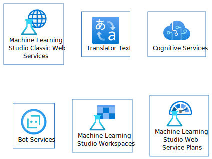

## Analytics

## AppServices

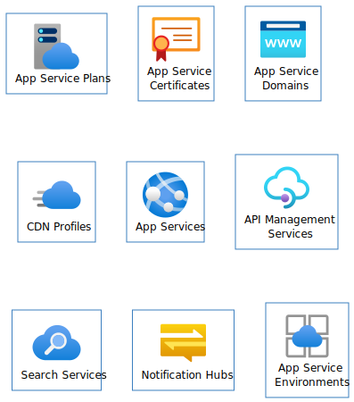

## Azure Stack

## Azure VMWare Solution

## Blockchain

## Compute

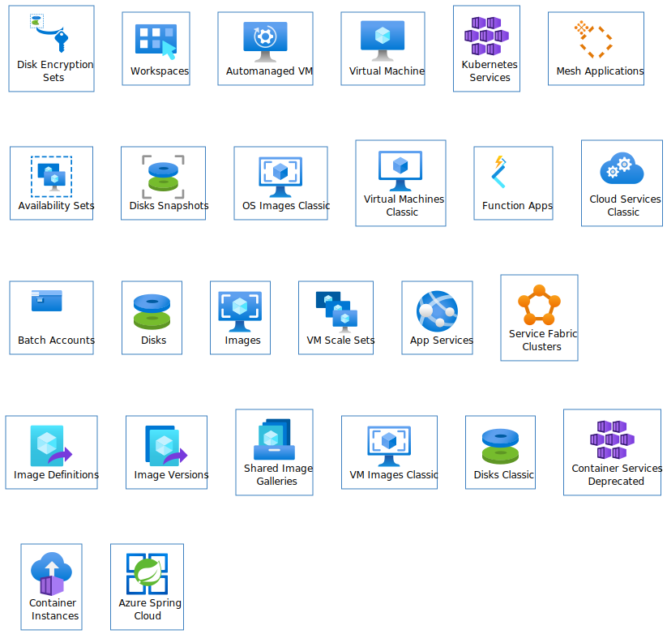

## Containers

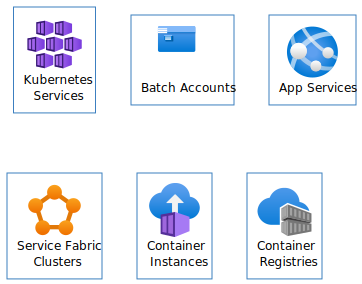

## Databases

## DevOps

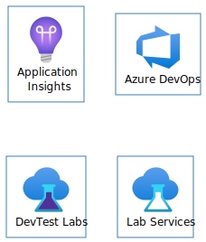

## General

## Identity

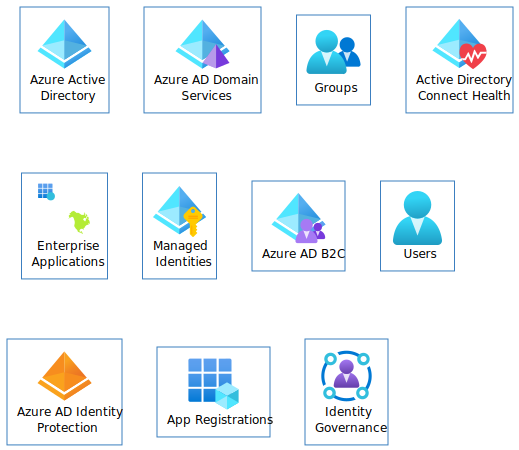

## Integration

## Internet of Things

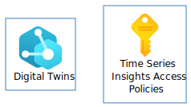

## Intune

## IoT

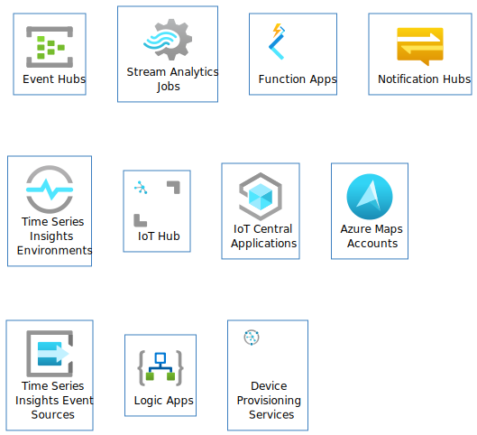

## Management and Governance

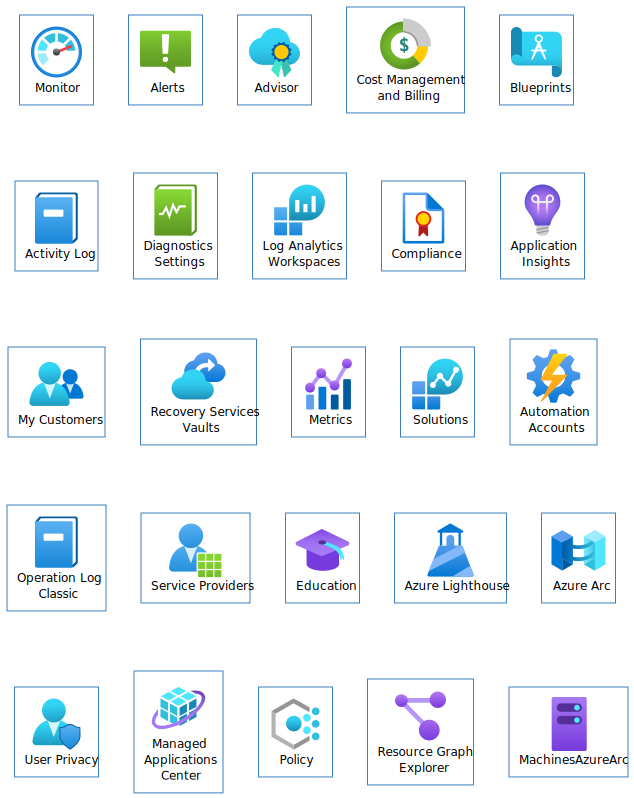

## Media Services

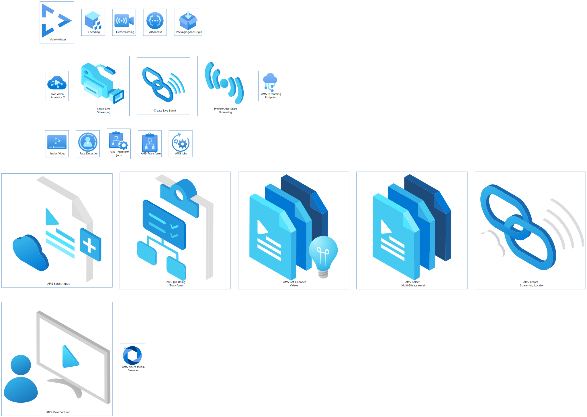

## Migrate

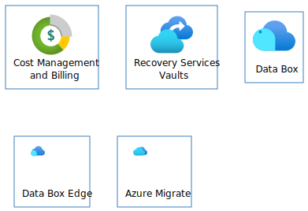

## Mixed Reality

## Monitor

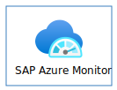

## Networking

## Other

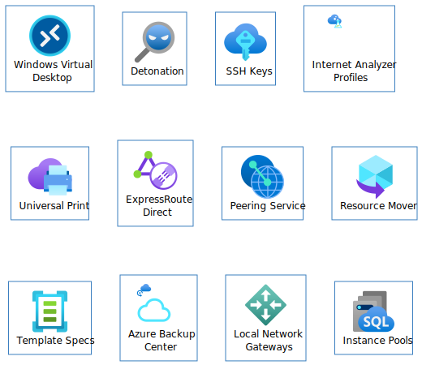

## Preview

## Security

## Storage

## Web

