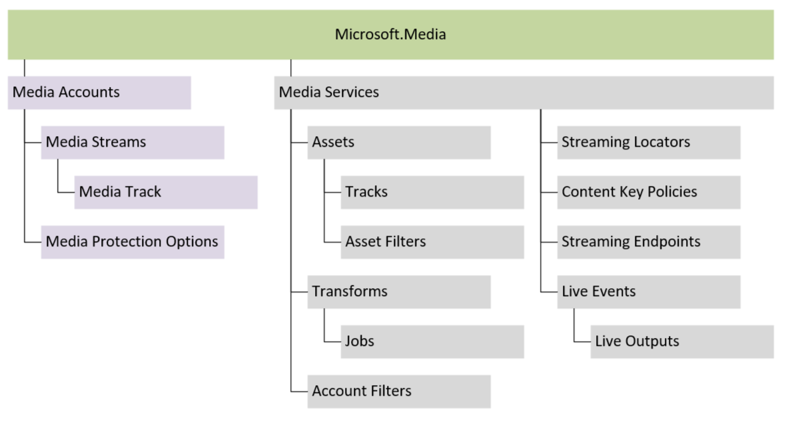

# Media Accounts

[!INCLUDE [<prerelease-api>](../includes/prerelease-api.md)]

**Media accounts** provide a simple, scalable, and reliable way to manage media using Azure. Media accounts can be used to stream live events to audiences of any size.

Media accounts are an alternative to Media Services accounts. Media accounts make streaming media simple, but do not provide as much flexibility as Media Services accounts.

| Feature | Media Services | Media accounts |
|---|---|---|
| Account location | Any of 50+ Azure regions | Global |
| Data storage | Media data is stored in one or more Azure Storage accounts, managed by the account owner | Storage for media data is managed by Media Services |
| Streaming scale | Optional CDN integration, configured by the account owner | Service managed high-scale streaming |
| Content protection | Clear key and DRM protection, using user defined token authentication | Clear key protection using simple tokens |
| API | APIs for managing, streaming, protecting, and encoding media | Simple APIs for streaming live media |

Media accounts contain [media streams](media-streams.md) for streaming media content and [media protections](media-protections.md) for protecting media content.

## Creating a media account

Media accounts can be created using the Azure Portal, ARM templates, client SDKs, or using HTTP requests. 

#### [C#](#tab/csharp)

[!INCLUDE [<notes-for-csharp-setup>](../includes/notes-for-csharp-setup.md)]
[!INCLUDE [<csharp-arm-client-setup>](../includes/csharp-arm-client-setup.md)]

Media account creation:

[!INCLUDE [<csharp-account-creation>](../includes/csharp-account-crud-create.md)]

#### [HTTP](#tab/http)

[!INCLUDE [<http-account-creation](../includes/http-account-crud-create.md)]

---

## Media account options

### Data location

Media accounts are a global Azure resource and media may be processed and cached in any Azure region. Media content is stored in the
location specified when the account is created using the `dataLocation` property. `dataLocation` is set to an Azure geography, for example
`United States` or `Europe`, data may be stored within any Azure region in the geography. The data location of an account may not be
changed after the account has been created.

### Public network access

Media accounts can be configured to block all requests from public networks using the `publicNetworkAccess` property. When public
network access is blocked, media may only be streamed using a [private endpoint](../v2/network-security.md).

#### [C#](#tab/csharp)

[!INCLUDE [<csharp-account-creation-public-network-access>](../includes/csharp-account-creation-public-network-access.md)]

#### [HTTP](#tab/http)

[!INCLUDE [<http-account-creation-public-network-access](../includes/http-account-creation-public-network-access.md)]

---

### Managed identity

Media accounts use managed identities to access keys used for account encryption and certificates for content key token signing.

Managed identities are configured using the `identity` property of the media account:

#### [C#](#tab/csharp)

[!INCLUDE [<csharp-account-creation-managed-identity>](../includes/csharp-account-creation-managed-identity.md)]

#### [HTTP](#tab/http)

[!INCLUDE [<http-account-creation-managed-identity](../includes/http-account-creation-managed-identity.md)]

---

### Encryption

A media account may configured to encrypt data using a customer provided key. The customer provided key is used to encrypt
media content and media content keys when stored by the service (different keys are used when streaming media content to viewers).

To encrypt a media account using a customer provided key, a key must be created in a Key Vault:

#### [C#](#tab/csharp)

[!INCLUDE [<csharp-account-creation-encryption-create-key>](../includes/csharp-account-creation-encryption-create-key.md)]

#### [HTTP](#tab/http)

[!INCLUDE [<http-account-creation-encryption-create-key](../includes/http-account-creation-encryption-create-key.md)]

---

A managed identity associated with the media account must be granted access to key. The method for granting access
depends on the access model configured for the Key Vault.

Once a key has been created and the managed identity has been granted access to the key, the key may be set
in an account creation or update request:

#### [C#](#tab/csharp)

[!INCLUDE [<csharp-account-creation-encryption-set-key>](../includes/csharp-account-creation-encryption-set-key.md)]

#### [HTTP](#tab/http)

[!INCLUDE [<http-account-creation-encryption-set-key](../includes/http-account-creation-encryption-set-key.md)]

---

### Tags

Tags can be specified when creating or updating a media account:

#### [C#](#tab/csharp)

[!INCLUDE [<csharp-account-creation-tags>](../includes/csharp-account-creation-tags.md)]

#### [HTTP](#tab/http)

[!INCLUDE [<http-account-creation-tags](../includes/http-account-creation-tags.md)]

---

## Media account operations

### Updating a media account

The public network access, encryption properties, identity, and tags of an existing media account may be updated. After a media account has been created, the
location and data location properties may not be updated.

> [!CAUTION]
> Updating the identity properties of a media account may prevent Media Services from accessing account encryption keys
and token signing certificates stored in Azure Key Vault. The media account will be disabled if the account encryption
key cannot be accessed. Streams that depend on a token signing certificate will fail to play if the certificate cannot be
accessed.

#### [C#](#tab/csharp)

[!INCLUDE [<csharp-account-crud-update>](../includes/csharp-account-crud-update.md)]

#### [HTTP](#tab/http)

[!INCLUDE [<http-account-crud-update](../includes/http-account-crud-update.md)]

---

### Listing media accounts

Media accounts may be listed using the service API.

#### [C#](#tab/csharp)

[!INCLUDE [<csharp-account-crud-list>](../includes/csharp-account-crud-list.md)]

#### [HTTP](#tab/http)

[!INCLUDE [<http-account-crud-list](../includes/http-account-crud-list.md)]

---

### Deleting a media account

Media accounts may be deleted. When an account is deleted, all media content and service configuration is removed.

> [!CAUTION]
> It may not be possible to recover deleted media accounts. Consider using Azure resource locks to prevent accidental resource deletion.

#### [C#](#tab/csharp)

[!INCLUDE [<csharp-account-crud-delete>](../includes/csharp-account-crud-delete.md)]

#### [HTTP](#tab/http)

[!INCLUDE [<http-account-crud-delete](../includes/http-account-crud-delete.md)]

---

## Media account limits and billing

By default, an Azure subscription may contain up to fifty media accounts. While there is no charge for a media accounts, resources within a media account are billed.