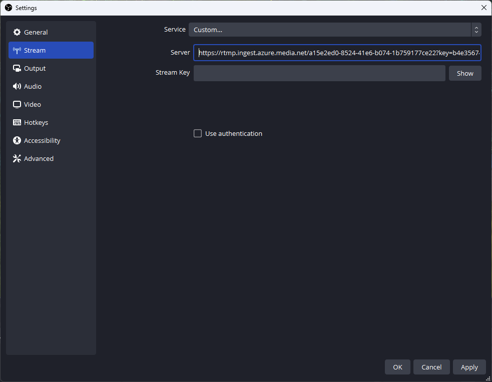
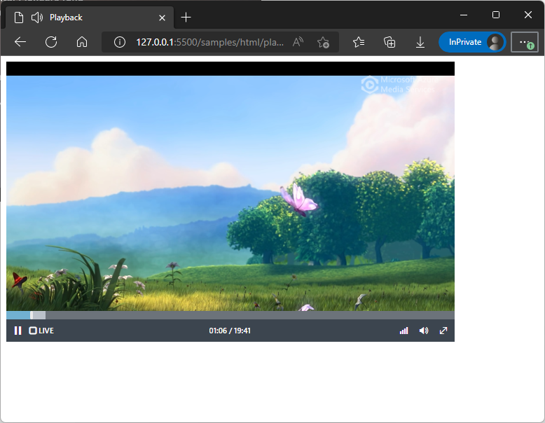

# Media Streams

Media streams can be used to stream live and recorded media. Media Services manages the storage and streaming resources for streaming.
A media stream account may contain up to one million media stream resources.

> [!NOTE]
> Media streams combine the Media Services asset, streaming locator, streaming endpoint, and live event resources. Unlike Media Services
accounts, there is no need to manage storage resources and CDNs used to store and stream media.

When a viewer watches a media stream, Media Services automatically adapts the media data to match the viewer's playback device capabilities
and network bandwidth. The selection of the streaming protocol (HLS, low-latency HLS, or DASH), media codec, and media bitrate are all
managed by Media Services.

Each media stream contains a collection of **outputs** which describe how the content may be accessed. A media stream may define multiple
outputs to preset the same content in multiple ways (for example, using different authentication options for different groups of users).

## Creating a media stream

Media streams can be created using the Azure Portal, ARM templates, client SDKs, or using HTTP requests. The request to create a media
stream specifies the outputs for the stream; the media stream creation response includes the streaming URLs for each output.

#### [C#](#tab/csharp)

[!INCLUDE [<notes-for-csharp-setup>](../includes/notes-for-csharp-setup.md)]
[!INCLUDE [<csharp-arm-client-setup>](../includes/csharp-arm-client-setup.md)]

Media stream creation:

[!INCLUDE [<csharp-media-stream-rtmp-create>](../includes/csharp-media-stream-rtmp-create.md)]

#### [HTTP](#tab/http)

[!INCLUDE [<http-media-stream-rtmp-create](../includes/http-media-stream-rtmp-create.md)]

---

## Streaming media to a media stream using RTMP

After creating a media stream, you can stream media to the stream using RTMP.

#### [C#](#tab/csharp)

[!INCLUDE [<csharp-media-stream-start-rtmp-ingest>](../includes/csharp-media-stream-start-rtmp-ingest.md)]

#### [HTTP](#tab/http)

[!INCLUDE [<http-media-stream-start-rtmp-ingest](../includes/http-media-stream-start-rtmp-ingest.md)]

---

The response from the service contains the RTMP ingest URL. This can be used with source encoders to
stream to the media stream.

#### [Streaming with OBS](#tab/obs)



#### [Streaming with ffmpeg](#tab/ffmpeg)

```powershell
ffmpeg `
  -re `
  -i myvideo.mp4 `
  -c:v libx264 `
  -c:v aac `
  -f flv rtmps://rtmp.ingest.azure.media.net/a15e2ed0-8524-41e6-b074-1b759177ce22?key=b4e3567447a3219c7313
```

---

## Getting the media stream status

When the media stream starts receiving RTMP data, the state of the media stream will change to `Live`.

#### [C#](#tab/csharp)

[!INCLUDE [<csharp-media-stream-get>](../includes/csharp-media-stream-get.md)]

#### [HTTP](#tab/http)

[!INCLUDE [<http-media-stream-get](../includes/http-media-stream-get.md)]

---

## Live streaming

The live stream can be viewed using a player. Media can be streamed in a web page using Azure Media Player:

```html
<!DOCTYPE html>
<html lang="en">

<head>
  <title>Playback</title>
  <link href="//amp.azure.net/libs/amp/latest/skins/amp-default/azuremediaplayer.min.css" rel="stylesheet">
  <script src="//amp.azure.net/libs/amp/latest/azuremediaplayer.min.js"></script>
</head>

<body>
  <video class="azuremediaplayer amp-default-skin" autoplay controls width="640" height="400">
    <source src="//stream.azure.media.net/2ddc6abd-2d3d-4b30-a696-754bb90d3a8a" type="application/vnd.ms-sstr+xml" />
</video>
</body>

</html>
```



## Stopping a live stream

When a live stream is complete, RTMP ingest can be stopped. 

#### [C#](#tab/csharp)

[!INCLUDE [<csharp-media-stream-start-rtmp-ingest>](../includes/csharp-media-stream-stop-rtmp-ingest.md)]

#### [HTTP](#tab/http)

[!INCLUDE [<http-media-stream-start-rtmp-ingest](../includes/http-media-stream-stop-rtmp-ingest.md)]

---

When ingest is stopped, the media stream will transition to on-demand streaming. Players will switch from the live
view to video playback mode.


## Media stream operations

### Updating a media stream

Media streams can be updated to add or remove outputs. The enabled property of outputs may also be updated.

#### [C#](#tab/csharp)

[!INCLUDE [<csharp-media-stream-update>](../includes/csharp-media-stream-update.md)]

#### [HTTP](#tab/http)

[!INCLUDE [<http-media-stream-update](../includes/http-media-stream-update.md)]

---

### Listing media streams

Media streams may be listed using the service API.

> [!NOTE]
> The API does not provide support for filtering or sorting lists of media streams. If your application requires a large number
of media streams, consider using a database to store media stream metadata.

#### [C#](#tab/csharp)

[!INCLUDE [<csharp-media-stream-list>](../includes/csharp-media-stream-list.md)]

#### [HTTP](#tab/http)

[!INCLUDE [<http-media-stream-list](../includes/http-media-stream-list.md)]

---

### Deleting a media stream

Deleting a media stream deletes the media associated with the stream, stops any RTMP input, and disables streaming from
each of the outputs defined in the media stream.

#### [C#](#tab/csharp)

[!INCLUDE [<csharp-media-stream-delete>](../includes/csharp-media-stream-delete.md)]

#### [HTTP](#tab/http)

[!INCLUDE [<http-media-stream-delete](../includes/http-media-stream-delete.md)]

---

## Media stream limits and billing

A media stream account may have up to one million media streams. Media streams are billed for the number of minutes of content stored,
the number of minutes of ingest, and the number of minutes of content streamed.