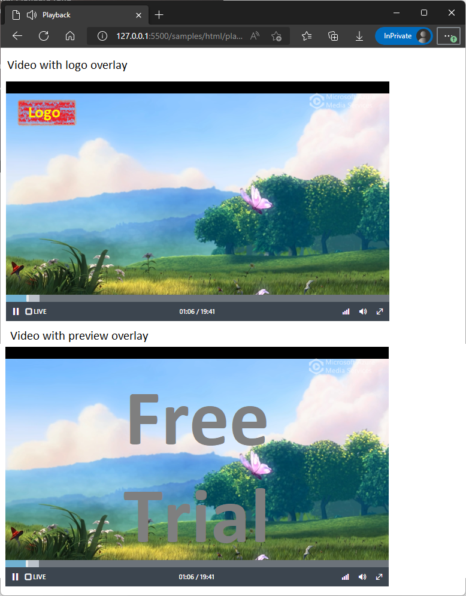
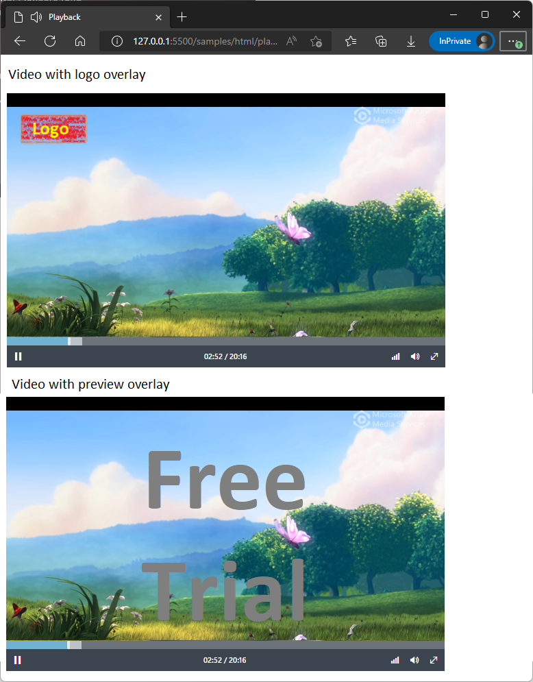

# Stream Overlays

[!INCLUDE [<prerelease-api>](../includes/future-api.md)]

Overlays can be added to media stream outputs, for example to add a service logo or to indicate a trial subscription.

## Creating a media stream with an overlay

Overlays are configured when the media stream, is created:

#### [C#](#tab/csharp)

[!INCLUDE [<notes-for-csharp-setup>](../includes/notes-for-csharp-setup.md)]
[!INCLUDE [<csharp-arm-client-setup>](../includes/csharp-arm-client-setup.md)]

Media stream creation:

[!INCLUDE [<csharp-media-stream-overlay-create>](../includes/csharp-media-stream-overlay-create.md)]

#### [HTTP](#tab/http)

[!INCLUDE [<http-media-stream-overlay-create](../includes/http-media-stream-overlay-create.md)]

---

Before streaming content to the media stream, the overlay files must be uploaded:

#### [C#](#tab/csharp)

[!INCLUDE [<csharp-media-stream-start-upload-ingest>](../includes/csharp-media-stream-start-upload-ingest.md)]

#### [HTTP](#tab/http)

[!INCLUDE [<http-media-stream-start-upload-ingest](../includes/http-media-stream-start-upload-ingest.md)]

---

Overlay files can be uploaded using the Azure Storage API:

#### [C#](#tab/csharp)

[!INCLUDE [<csharp-media-stream-overlay-upload>](../includes/csharp-media-stream-overlay-upload.md)]

#### [HTTP](#tab/http)

[!INCLUDE [<http-media-stream-overlay-upload](../includes/http-media-stream-overlay-upload.md)]

---

Once the overlay files have been uploaded, the complete update API must be called:

#### [C#](#tab/csharp)

[!INCLUDE [<csharp-media-stream-complete-upload-ingest>](../includes/csharp-media-stream-complete-upload-ingest.md)]

#### [HTTP](#tab/http)

[!INCLUDE [<http-media-stream-complete-upload-ingest](../includes/http-media-stream-complete-upload-ingest.md)]

---


## Streaming media to a media stream using RTMP

After creating a media stream, you can stream media to the stream using RTMP.

#### [C#](#tab/csharp)

[!INCLUDE [<csharp-media-stream-start-rtmp-ingest>](../includes/csharp-media-stream-start-overlay-ingest.md)]

#### [HTTP](#tab/http)

[!INCLUDE [<http-media-stream-start-rtmp-ingest](../includes/http-media-stream-start-overlay-ingest.md)]

---

The response from the service contains the RTMP ingest URL. This can be used with source encoders to
stream to the media stream.

#### [Streaming with OBS](#tab/obs)


#### [Streaming with ffmpeg](#tab/ffmpeg)

```powershell
ffmpeg `
  -re `
  -i myvideo.mp4 `
  -c:v libx264 `
  -c:v aac `
  -f flv rtmps://rtmp.ingest.azure.media.net/a15e2ed0-8524-41e6-b074-1b759177ce22?key=b4e3567447a3219c7313
```

---

## Live streaming

The live stream can be viewed using a player. Media can be streamed in a web page using Azure Media Player:

```html
<!DOCTYPE html>
<html lang="en">

<head>
  <title>Playback</title>
  <link href="//amp.azure.net/libs/amp/latest/skins/amp-default/azuremediaplayer.min.css" rel="stylesheet">
  <script src="//amp.azure.net/libs/amp/latest/azuremediaplayer.min.js"></script>
</head>

<body>
  <h1>Video with logo overlay</h1>
  <video class="azuremediaplayer amp-default-skin" autoplay controls width="640" height="400">
    <source src="//stream.azure.media.net/15cbc6b7-a668-7e18-bce5-c02000a1c5a0" type="application/vnd.ms-sstr+xml" />

  <h1>Video with preview overlay</h1>
  <video class="azuremediaplayer amp-default-skin" autoplay controls width="640" height="400">
    <source src="//stream.azure.media.net/919de0bf-73de-48d5-8118-53b007a41d6f" type="application/vnd.ms-sstr+xml" />
</video>
</body>

</html>
```



## Stopping a live stream

When a live stream is complete, RTMP ingest can be stopped. 

#### [C#](#tab/csharp)

[!INCLUDE [<csharp-media-stream-start-rtmp-ingest>](../includes/csharp-media-stream-stop-overlay-ingest.md)]

#### [HTTP](#tab/http)

[!INCLUDE [<http-media-stream-start-rtmp-ingest](../includes/http-media-stream-stop-overlay-ingest.md)]

---

When ingest is stopped, the media stream will transition to on-demand streaming. Players will switch from the live
view to video playback mode.


