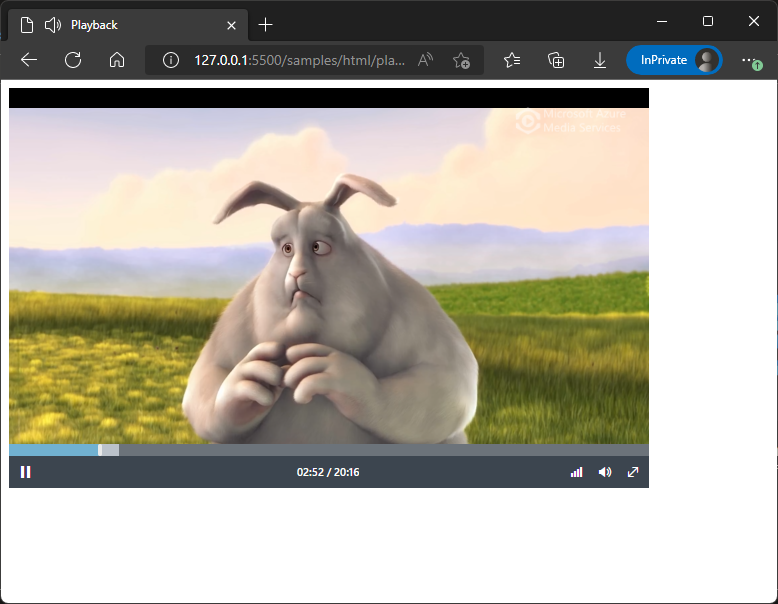

# Streaming on-demand videos

[!INCLUDE [<prerelease-api>](../includes/future-api.md)]

Media data can be uploaded to media stream. When data is uploaded, the media content is copied and converted into format that can be streamed.

## Creating a media stream by uploading files

To create a media stream from uploaded files, a new media stream must be created:

#### [C#](#tab/csharp)

[!INCLUDE [<notes-for-csharp-setup>](../includes/notes-for-csharp-setup.md)]
[!INCLUDE [<csharp-arm-client-setup>](../includes/csharp-arm-client-setup.md)]

Media stream creation:

[!INCLUDE [<csharp-media-stream-upload-create>](../includes/csharp-media-stream-upload-create.md)]

#### [HTTP](#tab/http)

[!INCLUDE [<http-media-stream-upload-create](../includes/http-media-stream-upload-create.md)]

---

After creating a media stream, an upload URL can be requested:

#### [C#](#tab/csharp)

[!INCLUDE [<csharp-media-stream-start-upload-ingest>](../includes/csharp-media-stream-start-upload-ingest.md)]

#### [HTTP](#tab/http)

[!INCLUDE [<http-media-stream-start-upload-ingest](../includes/http-media-stream-start-upload-ingest.md)]

---

Media Services may need to process the content before it can be streamed. While the content is being processed, the
media stream state will be `Processing`:

#### [C#](#tab/csharp)

[!INCLUDE [<csharp-media-stream-upload-get-1>](../includes/csharp-media-stream-upload-get-1.md)]

#### [HTTP](#tab/http)

[!INCLUDE [<http-media-stream-upload-get-1](../includes/http-media-stream-upload-get-1.md)]

---

When the media stream is ready to be viewed, the media stream state will be `OnDemand`:

#### [C#](#tab/csharp)

[!INCLUDE [<csharp-media-stream-upload-get-2>](../includes/csharp-media-stream-upload-get-2.md)]

#### [HTTP](#tab/http)

[!INCLUDE [<http-media-stream-upload-get-2](../includes/http-media-stream-upload-get-2.md)]

---

> [!NOTE]
> Media Services uses a combination of preprocessing and just-in-time encoding to prepare media content for streaming.
The time to process media depends on the format of the uploaded files. When the uploaded content meets the requirements
for just-in-time encoding, media files can be ready for streaming almost immediately after the upload is complete.

## Viewing the media stream

Once the media content has been processed, it may be viewed using a player. Media can be streamed in a web page using Azure Media Player:

```html
<!DOCTYPE html>
<html lang="en">

<head>
  <title>Playback</title>
  <link href="//amp.azure.net/libs/amp/latest/skins/amp-default/azuremediaplayer.min.css" rel="stylesheet">
  <script src="//amp.azure.net/libs/amp/latest/azuremediaplayer.min.js"></script>
</head>

<body>
  <video class="azuremediaplayer amp-default-skin" autoplay controls width="640" height="400">
    <source src="//stream.azure.media.net/2ddc6abd-2d3d-4b30-a696-754bb90d3a8a" type="application/vnd.ms-sstr+xml" />
</video>
</body>

</html>
```


